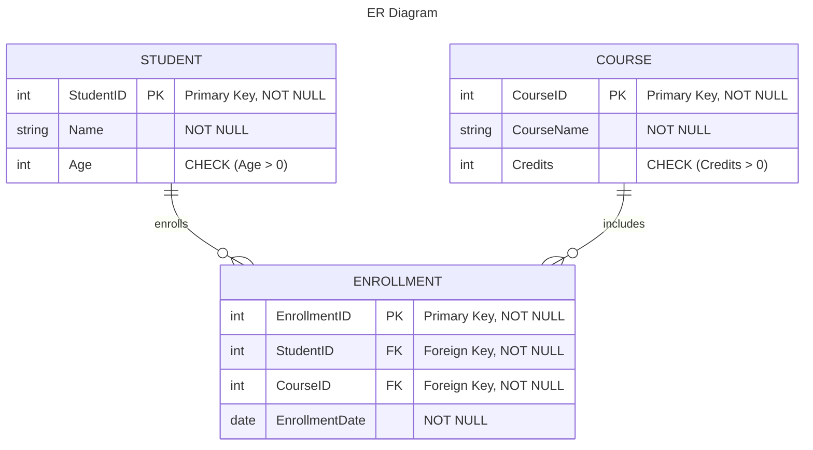
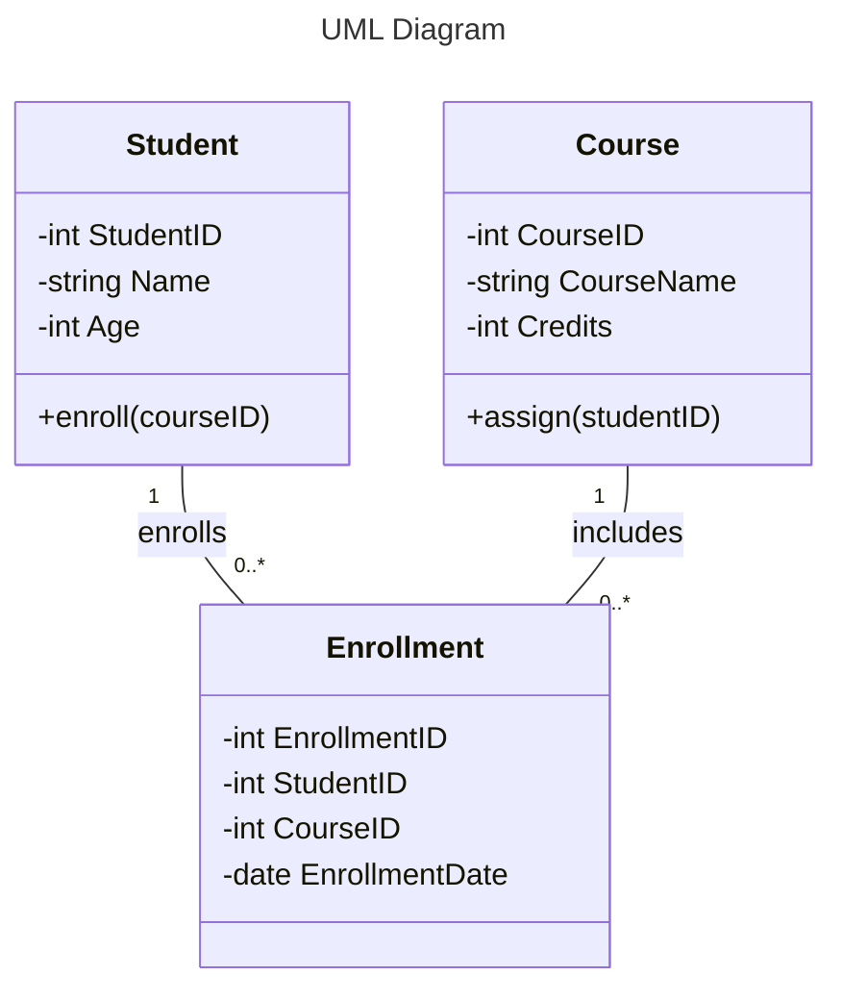
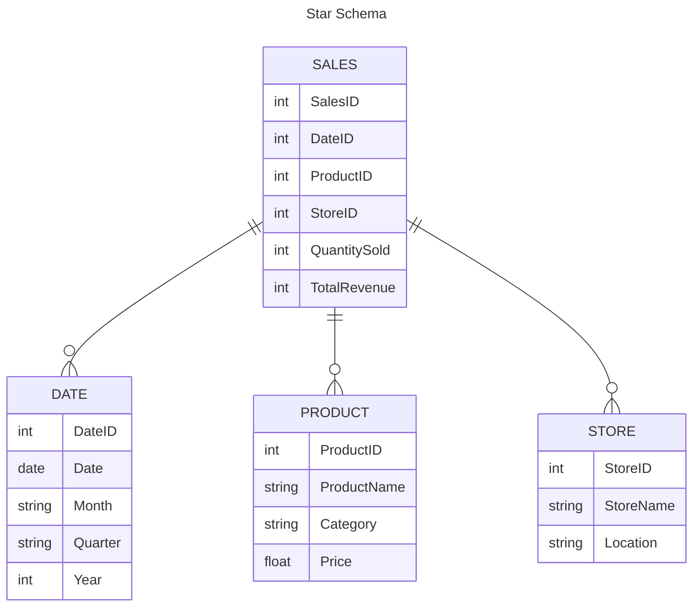
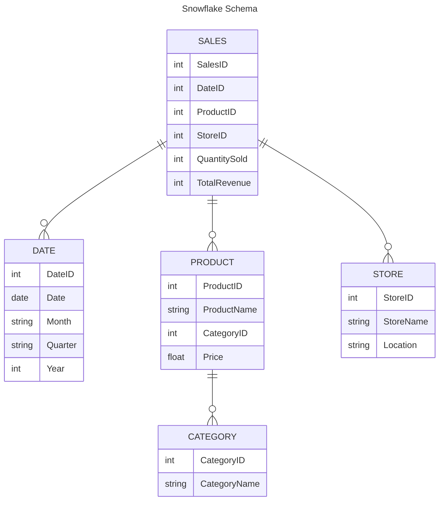

## What is Data Modeling?
---

The goal of data modeling to illustrate the types of data used and stored within the system, the relationships among these data types, the ways the data can be grouped and organized and its formats and attributes.

**Importance of Data Modeling**
- Clarifies Data Requirements
- Improves Database Design
- Enhances Data Quality
- Facilitates Data Integration
- Supports Data Management
- Optimizes Query Performance
- Reduces Development Costs
- Ensures Compliance and Governance
- Supports Data Analytics

## Types of Data Models
---

{: width="700" height="400" }

### 1. Conceptual

The conceptual data model provides high level overview, focusing on the entities(tables) and their relationships without going into technical details. It is more like a blueprint of the overall structure. Usually, Business Analysts, Data Architects, and Stakeholders work on building this model.

### 2. Logical
The logical data model adds more detail to the conceptual model by defining the attributes(columns) of each entity and the relationship between them but it does not consider how the data will be physically stored. Modelled by Data Analysts, Data Modelers, Data Architects, etc.

### 3. Physical
The physical data model translates the logical model into an actual database implementation, specifying tables, columns, data types, and constraints to accurately reflect how data will be stored, accessed, and managed in the database system. This is usually done by Data Engineers, Database Engineers.

## Components of Data Models
---

### 1. Entities
Entities represent objects or concepts that has data stored about them. You can think of it as a table in a database. Each entity is distinct in the real world with an independent existence. Example of entities in a `University` database can be `Student`, `Course`, `Instructor`, and `Department`.

### 2. Attributes
Attributes are the properties or characteristics of an entity. They describe various aspects of the entity and hold data values. For the `Student` entity mentioned above, attributes might include `StudentID`, `Name`, `Email`, and `DateOfBirth`. For the `Course` entity, attributes could be `CourseName`, `Credits`, and `Department`. Think of entities as the columns of a table in a database.

| Attribute     |
|---------------|
| StudentID     |
| Name          |
| Email         | 
| DateOfBirth   |

| Attribute     |
|---------------|
| CourseID      |
| CourseName    |
| Credits       |
| DepartmentID  |

### 3. Relationships
Relationships describe how entities interact with one another. They define the associations between different entities.

- **One-to-One:** Each instance of one entity relates to one instance of another entity. In the below tables, each student has one card.

    | StudentID | Name     | Age |
    |-----------|----------|-----|
    | 1         | Alice    | 20  |
    | 2         | Bob      | 22  |

    | CardID | StudentID | IssueDate  |
    |--------|-----------|------------|
    | 101    | 1         | 2023-09-01 |
    | 102    | 2         | 2023-09-02 |

- **One-to-Many:** One instance of an entity relates to multiple instances of another entity. In the below tables, one Professor offers multiple Courses.

    | ProfessorID | Name        | Department     |
    |-------------|-------------|----------------|
    | 1           | Dr. Smith   | Computer Science|
    | 2           | Dr. Johnson | Mathematics    |

    | CourseID | CourseName   | ProfessorID |
    |----------|--------------|-------------|
    | 1        | Algorithms   | 1           |
    | 2        | Data Structures | 1       |
    | 3        | Calculus     | 2           |

- **Many-to-Many:** Multiple instances of one entity relate to multiple instances of another entity. In the below tables, Students enroll in multiple Courses, and each Course has multiple Students.

    | StudentID | Name     | Age |
    |-----------|----------|-----|
    | 1         | Alice    | 20  |
    | 2         | Bob      | 22  |
    | 3         | Charlie  | 21  |

    | CourseID | CourseName   |
    |----------|--------------|
    | 1        | Algorithms   |
    | 2        | Data Structures |
    | 3        | Calculus     |

    | EnrollmentID | StudentID | CourseID |
    |--------------|-----------|----------|
    | 1            | 1         | 1        |
    | 2            | 1         | 2        |
    | 3            | 2         | 2        |
    | 4            | 3         | 3        |
    | 5            | 3         | 1        |

### 4. Constraints 

Constraints are rules applied to data to ensure its integrity and consistency within the database.
- **Primary Key:** Ensures that each record in a table is unique and not null. In a `Student` table, the `StudentID` column is designated as the primary key, ensuring that every student has a unique identifier.

    | StudentID | Name     | Age |
    |-----------|----------|-----|
    | 1         | Alice    | 20  |
    | 2         | Bob      | 22  |

- **Foreign Key:** Ensures referential integrity by linking foreign keys to primary keys in another table. In an `Enrollment` table, the `StudentID` column is a foreign key that references the `StudentID` column in the above `Student` table, ensuring that each enrollment record corresponds to an existing student.

    | EnrollmentID | StudentID | CourseID |
    |--------------|-----------|----------|
    | 1            | 1         | 101      |
    | 2            | 2         | 102      |
    | 3            | 1         | 103      |

- **Unique Key:** Ensures all values in a column or a set of columns are unique. In an `User` table, the `Email` column is a unique key, ensuring that no two users can have the same email address.

    | UserID | Username | Email           |
    |--------|----------|-----------------|
    | 1      | john_doe | john@example.com|
    | 2      | jane_smith | jane@example.com|
    | 3      | bob_jones | bob@example.com|

- **Composite Key:** A combination of two or more columns used to create a unique identifier for a record. In an `Enrollment` table, the combination of `StudentID` and `CourseID` columns forms a composite key, ensuring that each student can enroll in a specific course only once.

    | StudentID | CourseID | EnrollmentDate|
    |-----------|----------|---------------|
    | 1         | 101      | 2023-09-01    |
    | 1         | 102      | 2023-09-02    |
    | 2         | 101      | 2023-09-03    |

- **Candidate Key:** A column, or set of columns, that can uniquely identify any record without any null values. In a `Car` table, both the `VIN` (Vehicle Identification Number) and `LicensePlate` could serve as candidate keys because either can uniquely identify a car.

    | VIN          | LicensePlate | Model       |
    |--------------|--------------|-------------|
    | 1HGCM82633A123456 | ABC123 | Honda Accord |
    | 1HGCM82633A123457 | XYZ789 | Toyota Camry |

- **Alternate Key:** A candidate key that is not the primary key. In an `Employee` table, if the `EmployeeID` is the primary key, the `NationalInsuranceNumber` can be an alternate key because it also uniquely identifies an employee but is not chosen as the primary key.

    | EmployeeID | NationalInsuranceNumber | Name    |
    |------------|-------------------------|---------|
    | 1          | NI123456A               | John Doe|
    | 2          | NI789012B               | Jane Smith|

- **Super Key:** A set of one or more columns that can uniquely identify a record in a table. In an `Order` table, the combination of `OrderID`, `CustomerID`, and `OrderDate` can be considered a super key, as the combination of these columns uniquely identifies each order, even though it may include unnecessary columns for uniqueness.

    | OrderID | CustomerID | OrderDate  |
    |---------|------------|------------|
    | 1       | 1001       | 2023-07-01 |
    | 2       | 1002       | 2023-07-02 |

- **Not Null:** Ensures that a column cannot have a NULL value. In an `Employee` table, the `LastName` column has a NOT NULL constraint, ensuring that every employee record must have a last name.

    | EmployeeID | FirstName | LastName | Age |
    |------------|-----------|----------|-----|
    | 1          | John      | Doe      | 30  |
    | 2          | Jane      | Smith    | 25  |

- **Check:** Ensures that all values in a column satisfy a specific condition. In a `Product` table, the `Price` column has a CHECK constraint to ensure that the price is always greater than zero.

    | ProductID | ProductName | Price |
    |-----------|-------------|-------|
    | 1         | Laptop      | 999.99|
    | 2         | Mouse       | 19.99 |
    | 3         | Keyboard    | -10.00|  <-- This entry would violate the CHECK constraint

- **Default:** Assigns a default value to a column when no value is specified. In an `Order` table, the `OrderStatus` column has a DEFAULT constraint that sets the default status to 'Pending' if no status is provided.

    | OrderID | CustomerID | OrderDate  | OrderStatus |
    |---------|------------|------------|-------------|
    | 1       | 1001       | 2023-07-01 | Pending     |
    | 2       | 1002       | 2023-07-02 | Shipped     |
    | 3       | 1003       | 2023-07-03 |             |  <-- This entry would have 'Pending' as default OrderStatus

### 5. Indexes
---

Indexes are used to improve the speed of data retrieval operations on a database table. They work by creating a data structure that allows the database to find data more quickly than if it had to scan the entire table. Here are some examples of different types of indexes and when they are used:

- **Clustered Index:** It determines the physical order of data in a table where it stores data in the same order as the index. Each table can have only one clustered index and used when queries search for range and retrieves large amount of data in sorted order. By default, the primary key constraint creates a clustered index.

- **Non-Clustered Index:** It creates a seperate structure from the table data and contains a sorted list of reference to the table, but the data itself is not stored in the index order. A table can have multiple non-clustered indexes. Used when queries look for exact match and when multiple columns need to be indexed.

| Feature           | Clustered Index                              | Non-Clustered Index                      |
|-------------------|----------------------------------------------|-----------------------------------------|
| Physical Order    | Determines the physical order of data        | Does not affect physical order          |
| Number per Table  | Only one                                      | Multiple                                |
| Use Cases         | Range queries, large data set retrieval      | Exact match queries, indexing multiple columns |
| Storage           | Data stored in the order of the index        | Separate structure with pointers to data|
| Example           | Primary key, frequently queried large tables | Search fields, composite indexes        |

- **Single Column Index:** This is the most basic type of index that is applied on a single column. Used when queries frequently search on a single column.

    Index on `LastName` in the `Employee` table.

    | EmployeeID | FirstName | LastName | Age |
    |------------|-----------|----------|-----|
    | 1          | John      | Doe      | 30  |
    | 2          | Jane      | Smith    | 25  |
    | 3          | Bob       | Johnson  | 40  |

- **Composite Index:** An index on multiple columns and is used when queries frequently search on a combination of columns.

    Composite index on `CustomerID` and `OrderDate` in the `Order` table.

    | OrderID | CustomerID | OrderDate  | Amount |
    |---------|------------|------------|--------|
    | 1       | 1001       | 2023-07-01 | 250.00 |
    | 2       | 1002       | 2023-07-02 | 150.00 |
    | 3       | 1001       | 2023-07-03 | 300.00 |

- **Full-Text Index:** Supports efficient searches on large text fields. Used when queries involve searching for keywords within text columns.

    Full-text index on `Content` in the `Article` table.

    | ArticleID | Title               | Content                            |
    |-----------|---------------------|------------------------------------|
    | 1         | Database Indexes    | Indexes are data structures...     |
    | 2         | Full-Text Search    | Full-text search allows...         |
    | 3         | SQL Performance     | Performance tuning in SQL...       |

- **Spatial Index:** Supports efficient searches on spatial data and is used when working with geographic or geometric data. 

    Spatial index on `Coordinates` in the `Location` table.

    | LocationID | Name        | Coordinates           |
    |------------|-------------|-----------------------|
    | 1          | Central Park| POINT(40.785091 -73.968285) |
    | 2          | Golden Gate | POINT(37.819929 -122.478255) |
    | 3          | Eiffel Tower| POINT(48.858844 2.294351)    |

> Single column, composite, full-text or spatial indexes can be either clustered or non-clustered. They refer to how many columns are included in the index, while clustered and non-clustered refer to how the data is stored and organized in the database. 
{: .prompt-info }

### 6. Diagrams
---

Diagrams visually represent the entities, attributes, and relationships within a data model. These depend on the type of technique that is used for Data Modeling. Let's look at two common techniques that are used.

- **Entity Relationship(ER) Diagrams:** It illustrate entities, their attributes, and the relationships between them, and is a default technique for modeling and designing relational databases. Below is an example.

- **Unified Modeling Language(UML) Diagrams:** It describe the structure of a system by showing its classes, attributes, methods, and the relationships among objects. Often used in object-oriented design. Below is an example.

## Normalization
---

Normalization aims to reduce redundancy and improve data integrity. It involves dividing large tables into smaller, related tables and defining relationships between them. The goal is to ensure that each data is stored only once, which minimizes redundancy and avoids anomalies. 

This generally improves write performances by reducing the need for data duplication and ensuring that updates, deletes and inserts are handled consistently and accurately. It also eases maintenance and increases flexibility. However, the impact on read performance can vary and be impacted negatively if many joins are required to assemble the data from normalized tables. 

### 1. First Normal Form (1NF)

Ensure each column contains atomic (indivisible) values and each column contains values of a single type.

- Original Table

    | StudentID | Name       | Courses           |
    |-----------|------------|-------------------|
    | 1         | Alice      | Math, Science     |
    | 2         | Bob        | Math, English     |

- Normalized Table (1NF)

    | StudentID | Name  | Course   |
    |-----------|-------|----------|
    | 1         | Alice | Math     |
    | 1         | Alice | Science  |
    | 2         | Bob   | Math     |
    | 2         | Bob   | English  |

### 2. Second Normal Form (2NF)

Meet all the requirements of 1NF and ensure that all non-key attributes are fully dependent on the primary key.

- Original Table(1NF)

    | StudentID | Name  | Course   | Instructor  |
    |-----------|-------|----------|-------------|
    | 1         | Alice | Math     | Dr. Smith   |
    | 1         | Alice | Science  | Dr. Johnson |
    | 2         | Bob   | Math     | Dr. Smith   |
    | 2         | Bob   | English  | Dr. Clark   |

- Normalized Table(2NF)

    | StudentID | Name  |
    |-----------|-------|
    | 1         | Alice |
    | 2         | Bob   |

    | Course   | Instructor  |
    |----------|-------------|
    | Math     | Dr. Smith   |
    | Science  | Dr. Johnson |
    | English  | Dr. Clark   |

    | StudentID | Course   |
    |-----------|----------|
    | 1         | Math     |
    | 1         | Science  |
    | 2         | Math     |
    | 2         | English  |

### 3. Third Normal Form (3NF)

Meet all the requirements of 2NF and ensure that all the attributes are functionally dependent only on the primary key.

- Original Table (2NF)

    | CourseID | CourseName | InstructorID | InstructorName |
    |----------|------------|--------------|----------------|
    | 1        | Math       | 101          | Dr. Smith      |
    | 2        | Science    | 102          | Dr. Johnson    |
    | 3        | English    | 103          | Dr. Clark      |

- Normalized table (3NF)

    | CourseID | CourseName  |
    |----------|-------------|
    | 1        | Math        |
    | 2        | Science     |
    | 3        | English     |

    | InstructorID | InstructorName |
    |--------------|----------------|
    | 101          | Dr. Smith      |
    | 102          | Dr. Johnson    |
    | 103          | Dr. Clark      |

    | CourseID | InstructorID |
    |----------|--------------|
    | 1        | 101          |
    | 2        | 102          |
    | 3        | 103          |

## Advanced Normalization
---

### 4. Boyce-Codd Normal Form (BCNF)

BCNF is used to eliminate redundancy and anomalies in the database, ensuring that the database is free from certain types of update anomalies that can still exist in 3NF.

**Example to Illustrate BCNF**

Consider a scenario with a university database where we have a table that records the subjects taught by instructors in different departments.

- Original Table (Not in BCNF)

    | Instructor | Subject    | Department |
    |------------|------------|------------|
    | Dr. Smith  | Databases  | CS         |
    | Dr. Clark  | Databases  | IT         |
    | Dr. Smith  | Networking | CS         |
    | Dr. Brown  | Networking | IT         |

- Normalization Process to BCNF

    To achieve BCNF, we decompose the table into two tables:

    | Instructor | Subject    |
    |------------|------------|
    | Dr. Smith  | Databases  |
    | Dr. Clark  | Databases  |
    | Dr. Smith  | Networking |
    | Dr. Brown  | Networking |

    | Subject    | Department |
    |------------|------------|
    | Databases  | CS         |
    | Databases  | IT         |
    | Networking | CS         |
    | Networking | IT         |

Now, both tables are in BCNF because the left-hand side of every non-trivial functional dependency is a superkey.

### 5. Fourth Normal Form (4NF)

The table must be in Boyce-Codd Normal Form (BCNF) and it should not have any multi-valued dependencies.

**Example to Illustrate 4NF**

Consider a university database where students can have multiple phone numbers and multiple email addresses.

- Original Table (Not in 4NF)

    | StudentID | PhoneNumber | EmailAddress       |
    |-----------|-------------|--------------------|
    | 1         | 1234567890  | alice@example.com  |
    | 1         | 0987654321  | alice@uni.edu      |
    | 2         | 5555555555  | bob@example.com    |
    | 2         | 4444444444  | bob@uni.edu        |

- Normalization Process to 4NF

    To achieve 4NF, we decompose the table into two tables:

    | StudentID | PhoneNumber |
    |-----------|-------------|
    | 1         | 1234567890  |
    | 1         | 0987654321  |
    | 2         | 5555555555  |
    | 2         | 4444444444  |

    | StudentID | EmailAddress      |
    |-----------|-------------------|
    | 1         | alice@example.com |
    | 1         | alice@uni.edu     |
    | 2         | bob@example.com   |
    | 2         | bob@uni.edu       |

    Both tables are now in 4NF because they do not have any multi-valued dependencies.

### 6. Fifth Normal Form (5NF)

The table must be in Fourth Normal Form (4NF) and there should be no join dependencies that are not implied by the candidate keys.

**Example to Illustrate 5NF**

Consider a project management database where projects can involve multiple suppliers and parts.

- Original Table (Not in 5NF)

    | ProjectID | SupplierID | PartID  |
    |-----------|------------|---------|
    | 1         | 101        | 5001    |
    | 1         | 101        | 5002    |
    | 1         | 102        | 5001    |
    | 2         | 103        | 5003    |

- Normalization Process to 5NF

    To achieve 5NF, we decompose the table into three tables:

    | ProjectID | SupplierID |
    |-----------|------------|
    | 1         | 101        |
    | 1         | 102        |
    | 2         | 103        |

    | ProjectID | PartID |
    |-----------|--------|
    | 1         | 5001   |
    | 1         | 5002   |
    | 2         | 5003   |

    | SupplierID | PartID |
    |------------|--------|
    | 101        | 5001   |
    | 101        | 5002   |
    | 102        | 5001   |
    | 103        | 5003   |

    These tables are now in 5NF because they eliminate redundancy and allow the original table to be reconstructed through joins.

> The decision to normalize beyond 3NF often depends on the specific business requirements and the nature of the data. Achieving BCNF, 4NF, and 5NF can lead to a highly normalized database, which may increase the complexity of queries and decrease performance due to the need for multiple joins. While it's less common to encounter BCNF, 4NF, and 5NF in everyday work compared to 3NF, understanding these higher normal forms is crucial for certain complex database designs.
{: .prompt-info }

## Denormalization
---

Denormalization is the process of combining normalized tables to improve read performance and simplify database queries. While normalization aims to reduce redundancy and ensure data integrity, denormalization introduces some redundancy intentionally to reduce the number of joins needed to retrieve data, thereby speeding up read operations.

**Advantages of Denormalization:**
- Faster Reads
- Simplified Queries
- Optimized Performance

**Disadvantages of Denormalization:**
- Increased Redundancy
- Simplified Queries
- Optimized Performance

**Example to Illustrate Denormalization**

- Normalized Tables

    | CustomerID | Name       | Email            |
    |------------|------------|------------------|
    | 1          | Alice      | alice@example.com|
    | 2          | Bob        | bob@example.com  |

    | OrderID | CustomerID | OrderDate  |
    |---------|------------|------------|
    | 101     | 1          | 2023-07-01 |
    | 102     | 2          | 2023-07-02 |

    | OrderDetailID | OrderID | ProductID | Quantity |
    |---------------|---------|-----------|----------|
    | 1001          | 101     | 501       | 2        |
    | 1002          | 101     | 502       | 1        |
    | 1003          | 102     | 503       | 5        |

    | ProductID | ProductName | Price |
    |-----------|-------------|-------|
    | 501       | Laptop      | 1000  |
    | 502       | Mouse       | 20    |
    | 503       | Keyboard    | 50    |

- Denormalized Table

    | OrderID | CustomerID | CustomerName | Email            | OrderDate  | ProductID | ProductName | Quantity | Price |
    |---------|------------|--------------|------------------|------------|-----------|-------------|----------|-------|
    | 101     | 1          | Alice        | alice@example.com| 2023-07-01 | 501       | Laptop      | 2        | 1000  |
    | 101     | 1          | Alice        | alice@example.com| 2023-07-01 | 502       | Mouse       | 1        | 20    |
    | 102     | 2          | Bob          | bob@example.com  | 2023-07-02 | 503       | Keyboard    | 5        | 50    |

## Dimensional Modeling

Dimensional modeling is a design technique used in data warehousing and business intelligence systems to structure data for querying and reporting. It organizes data into a schema that is optimized for retrieval and analysis rather than for transaction processing. The primary elements of dimensional modeling are facts and dimensions.

- **Facts:** Central tables that contain quantitative data for analysis.
- **Dimensions:** Tables that contain descriptive attributes related to the facts.

**Advantages of Dimensional Modeling**
- Optimized for Queries
- Simplifies Reporting
- Scalability

### 1. Star Schema
The simplest form of dimensional modeling. It consists of a central fact table surrounded by dimension tables. Each dimension table is directly linked to the fact table.

### 2. Snowflake Schema

A more normalized version of the star schema where dimension tables are further broken down into sub-dimension tables.

## Popular Data Modeling Tools

1. [Erwin Data Modeler](https://www.erwin.com/) - Comprehensive tool for data modeling, supports forward and reverse engineering, integrates with various databases. 

3. [Microsoft Visio](https://www.microsoft.com/en-us/microsoft-365/visio/flowchart-software) - Versatile diagramming tool that supports database modeling through templates and add-ons, integrates with other Microsoft Office tools.

5. [Oracle SQL Developer Data Modeler](https://www.oracle.com/database/sqldeveloper/) - Free tool from Oracle, supports multi-dimensional modeling, integrates with Oracle database products.